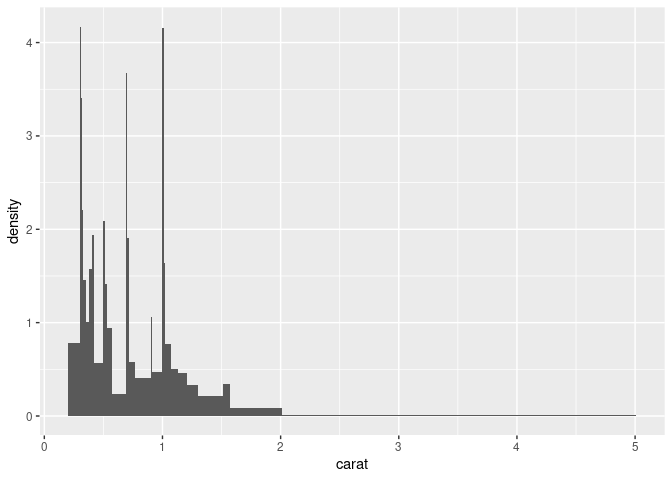

<!-- README.md is generated from README.Rmd. Please edit that file -->

# ggpercentogram

<!-- badges: start -->
<!-- badges: end -->

A percentogram is a histogram in which each bin has the same number of
observations and is drawn to have an equal area.

## Installation

You can install the development version of ggpercentogram like so:

``` r
remotes::install_github("eliocamp/ggpercentogram")
```

## Example

``` r
library(ggplot2)
library(ggpercentogram)
ggplot(diamonds, aes(carat)) +
  geom_percentogram()
#> `stat_quantile_bin()` using `bins = 30`. Pick better value with `binwidth`.
```


